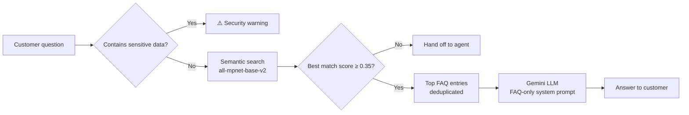

# 🏦 BankBuddy: Banking FAQ Chatbot (RAG)

A retrieval-augmented generation (RAG) chatbot that answers common banking customer questions for a fictional bank ("Demo Bank"). It combines semantic search over a curated FAQ dataset with the Gemini API, and adds banking-specific safety rules: sensitive-data blocking and human-agent handoff.

**🔗 Live demo:** [Try BankBuddy on Hugging Face Spaces](https://huggingface.co/spaces/YOUR-USERNAME/bankbuddy-chatbot)

> The FAQ categories are modeled on the kinds of questions I handled in banking customer service. All fees, limits, and phone numbers are fictional demo values.

---

## ✨ Features

- **Semantic search:** understands meaning, not just keywords ("the ATM ate my card" matches "The ATM kept my card").
- **Grounded answers:** Gemini answers *only* from retrieved FAQ entries, so it never invents fees, limits, or policies.
- **PII protection:** messages containing account numbers, SSNs, PINs, or passwords are blocked before reaching the LLM.
- **Agent handoff:** out-of-scope questions are routed to a human agent instead of guessed.
- **Resilient API calls:** automatic retries and model fallback when the LLM provider is busy.
- **Web interface:** Gradio chat UI, deployed on Hugging Face Spaces.

---

## 🏗️ Architecture



**How it works**

1. **Safety check:** a regex filter detects account/card numbers, SSNs, PINs, and passwords.
2. **Retrieval:** the question is embedded with a sentence-transformer model and compared against 138 FAQ phrasings using cosine similarity.
3. **Threshold:** if nothing is relevant enough, the bot hands off to an agent.
4. **Generation:** the top matching FAQs are sent to Gemini with a strict system prompt: answer only from these entries, otherwise hand off.

---

## 📊 Evaluation Results

Evaluated on 30 unseen test questions (phrased differently from the FAQ data), 5 sensitive-data inputs, and 5 out-of-scope questions.

| Embedding model | Top-1 accuracy | Top-3 accuracy | Sensitive data blocked | Out-of-scope handed off |
|---|---|---|---|---|
| all-MiniLM-L6-v2 (90 MB) | 73% | — | 100% | 100% |
| **all-mpnet-base-v2 (420 MB)** | **83%** | **97%** | **100%** | **100%** |

**LLM speed comparison** (6 test questions):

| LLM model | Total time | Answer quality |
|---|---|---|
| gemini-3.8-flash | ~2 min | Correct |
| **gemini-3.5-flash-lite** | **~23 s** | Correct |

### Key findings

- **Better embeddings mattered most.** Switching the embedding model improved top-1 accuracy from 73% to 83%. The smaller model often matched on surface words (e.g. "wrong *phone number*" → "Customer service *phone number*").
- **Top-3 accuracy is what the LLM sees.** Because the top FAQs are passed to Gemini, the correct answer reached the LLM 97% of the time.
- **Alternate phrasings help retrieval.** Adding 2–3 customer-style phrasings per FAQ raised a sample query's match score from 0.57 to 0.99.
- **A lighter LLM was enough.** For FAQ answering, the lite model was ~5x faster with no loss in answer quality.
- **Two layers against hallucination.** The retrieval threshold blocks unrelated questions, and the system prompt makes Gemini refuse when the FAQs don't cover the question.
- **Label ambiguity exists.** Some test questions reasonably fit more than one FAQ (e.g. an unrecognized charge could go to "fraud" or "dispute"), so a few "misses" are still acceptable answers.

---

## 📸 Screenshots

**Chat interface with example questions**


| Lost debit card | Monthly fee waiver | Zelle limit |
|---|---|---|
|  |  |  |

**Safety features: agent handoff and sensitive-data blocking**

An out-of-scope question (car loan) is handed off to an agent instead of answered with invented terms. When the same question includes an SSN, the safety check runs first and blocks the message before it reaches search or the LLM.


---

## 🧰 Tech Stack

- **Python**
- **Sentence-Transformers** (`all-mpnet-base-v2`) for semantic search
- **Google Gemini API** (`google-genai`) for answer generation
- **Gradio** for the chat interface
- **Pandas** for FAQ data handling
- **Hugging Face Spaces** for deployment
- **Google Colab** for development and evaluation

---

## 📁 Project Structure

```
├── app.py                      # Full chatbot + Gradio app (used by Hugging Face Spaces)
├── requirements.txt            # Python dependencies
├── banking_chatbot.ipynb       # Development and evaluation notebook
├── Screenshot 1.png, screenshot 2-5.png   # Demo screenshots
└── README.md
```

---

## 🚀 Run It Yourself

1. Get a free Gemini API key from [Google AI Studio](https://aistudio.google.com).
2. Clone the repo and install dependencies:
   ```bash
   pip install -r requirements.txt
   ```
3. Set your API key as an environment variable:
   ```bash
   export GEMINI_API_KEY="your-key-here"      # macOS/Linux
   set GEMINI_API_KEY=your-key-here           # Windows
   ```
4. Run the app:
   ```bash
   python app.py
   ```

---

## 🔮 Future Improvements

- Expand the FAQ dataset to 100+ entries and add a larger evaluation set
- Add conversation memory for follow-up questions
- Use a smarter PII detector (e.g. Microsoft Presidio) instead of regex
- Add a 👍/👎 feedback button and log unanswered questions to grow the FAQ
- Classify intent by category for analytics

---

## ⚠️ Disclaimer

This is a portfolio project for a **fictional bank**. It is not affiliated with any real financial institution, and all fees, limits, and contact numbers are made up.
